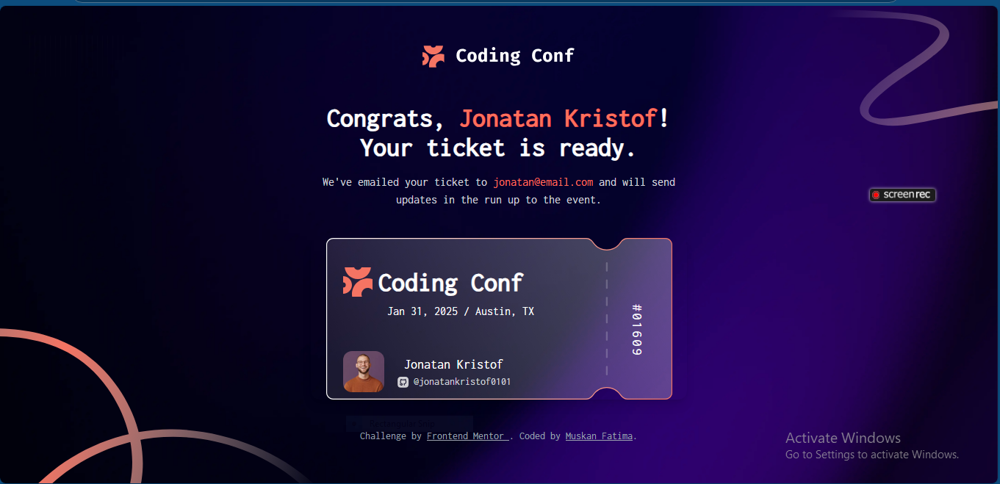

Sure, Muskan! Here's your updated `README.md` file tailored to **your project** – the **Conference Ticket Generator** – with your style, tools, and actual setup in mind:

---

# 🎫 Coding Conf 2025 - Ticket Generator

This is a solution to the [Conference ticket generator challenge on Frontend Mentor](https://www.frontendmentor.io/challenges/conference-ticket-generator-oq5gFIU12w). This project helped me enhance form validation, styling with Tailwind CSS, and overall UI/UX experience.

## 📑 Table of Contents

- [Overview](#overview)
  - [The Challenge](#the-challenge)
  - [Screenshot](#screenshot)
  - [Links](#links)
- [My Process](#my-process)
  - [Built With](#built-with)
  - [What I Learned](#what-i-learned)
  - [Continued Development](#continued-development)
  - [Useful Resources](#useful-resources)
- [Author](#author)
- [Acknowledgments](#acknowledgments)

---

## 💡 Overview

### The Challenge

Users should be able to:

- Fill in the form with their full name, email, and GitHub username
- Upload an avatar (JPG or PNG, max 500KB)
- Receive real-time validation messages:
  - Required fields
  - Invalid email format
  - Invalid avatar type/size
- Navigate and complete the form using only a keyboard
- See focus and hover states for interactive elements
- Get a styled conference ticket on successful submission
- Experience a responsive layout on all devices

### 🖼 Screenshot



_You can add your actual screenshot to the `screenshots/` folder and update the path above._

### 🔗 Links

- **Live Site URL**: [https://onference-ticket.vercel.app/](https://onference-ticket.vercel.app/)
- **Solution URL**: [https://github.com/muskan-fatim/onference-ticket.git](https://github.com/muskan-fatim/onference-ticket.git)

---


### 🛠 Built With

- Semantic **HTML5**
- **Tailwind CSS**
- **JavaScript**
- Mobile-first responsive design
- Vanilla file validation logic

### 🤓 What I Learned

- How to handle custom file uploads using a hidden file input
- Tailwind tricks for background images and layering
- Styling inputs and states like hover, focus, and disabled
- Writing accessible forms with proper `label` usage

```js
// Simple validation snippet I used
if (!email.includes('@')) {
  alert('Please enter a valid email address');
}
```

### 🔁 Continued Development

In future versions, I'd like to:

- Add preview for uploaded avatar
- Generate downloadable ticket using Canvas or HTML2Canvas
- Add form animation on submit
- Store submitted entries in localStorage or Firebase

### 📚 Useful Resources

- [Tailwind CSS Documentation](https://tailwindcss.com/docs/)
- [MDN Web Docs - File API](https://developer.mozilla.org/en-US/docs/Web/API/File)
- [A Complete Guide to Accessible Forms](https://www.smashingmagazine.com/2021/04/complete-guide-accessible-forms/)

---

## 👩‍💻 Author

- GitHub – [@mushii-fatima](https://github.com/muskan-fatim)
- Frontend Mentor – [@mushii-fatima](https://www.frontendmentor.io/profile/mushii-fatima)

---

## 🙌 Acknowledgments

Thanks to **Frontend Mentor** for the awesome challenge and design inspiration. Also a shoutout to the **GenEng Community** for all the support and motivation during this build!

---

Let me know if you want me to convert this into a downloadable `README.md` file for you too!